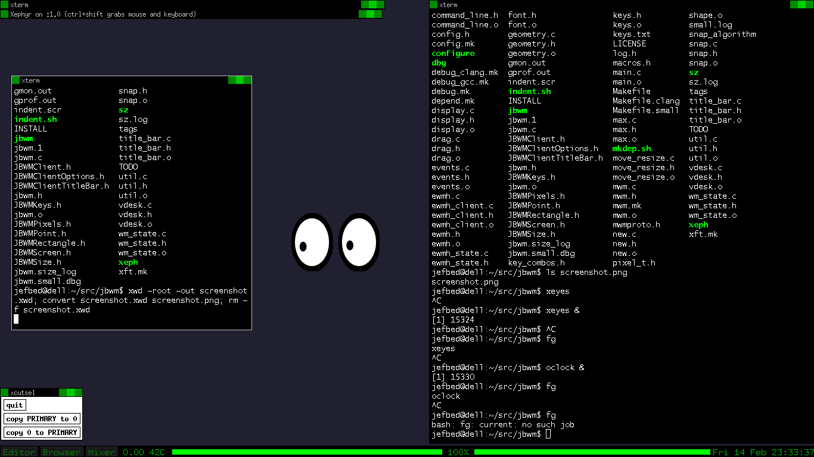

# JBWM


## FEATURES of JBWM
* *Virtual desktops* with Meta-{1-0}
* Tiny binary size
* *Titlebar* support if wanted
* *Xft* support if wanted
* *EWMH* support if wanted
* *Window shading* with title bar
* Code cleanups, simpler UI and key bindings
* Use of C11 features where possible.

## RELEASES
Releases are made when sufficient changes are made to the code base.  Releases
fixing crashes are made as soon as possible--such releases will be as tertiary
point releases, starting at x.x.1, if made soon after minor releases.  Such
releases may be delayed if a new minor release cycle has been started, unless a
bug is reported.  

## INSTALLATION
Edit configuration options in Makefile and config.h, then build:
```sh
	$ make
	# make install
```
On OpenBSD (bundled gcc is too old):
```sh
	$ make CC=clang
	# make install
```

## ACKNOWLEDGEMENTS

evilwm, by Ciaran Anscomb <evilwm@6809.org.uk>.  http://www.6809.org.uk/evilwm/

The original code base for this project was that of aewm by Decklin
Foster.  His code is very clean and, in later versions, very well
commented.  http://www.red-bean.com/~decklin/aewm/

